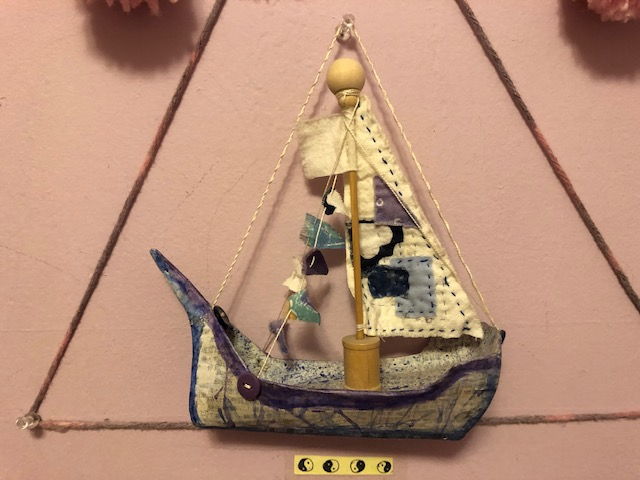
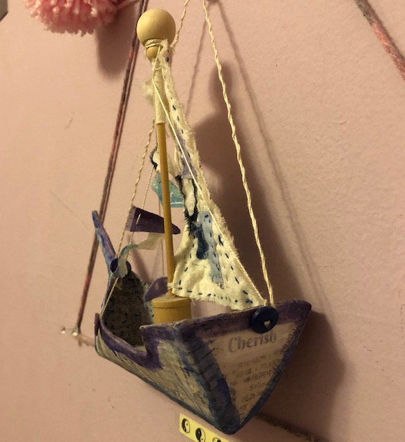
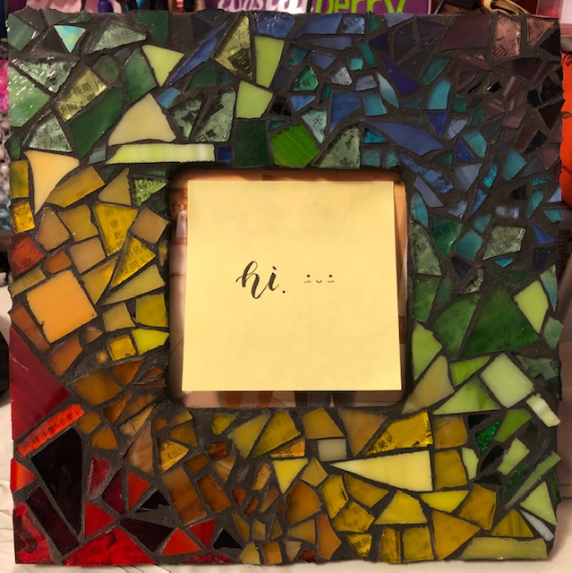
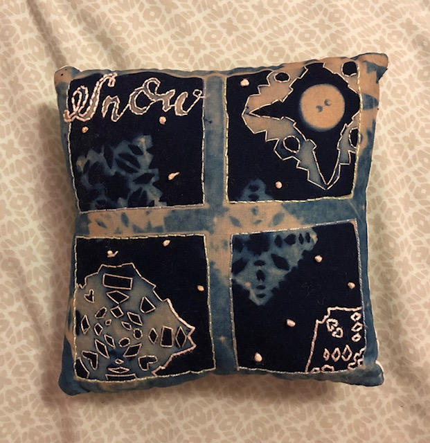
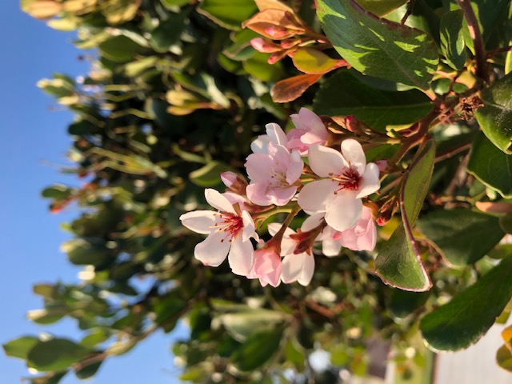
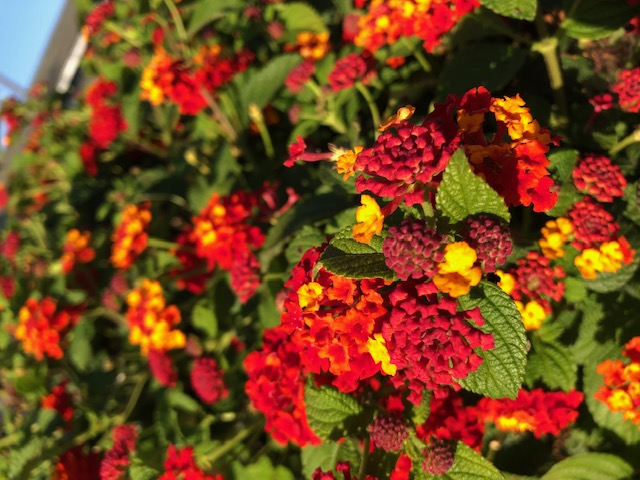
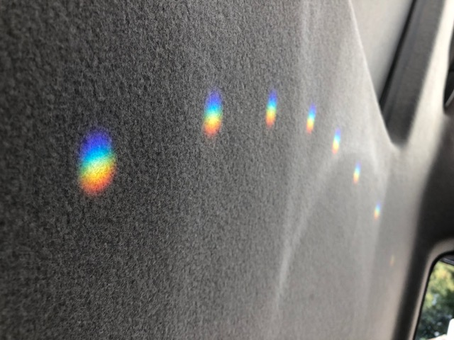
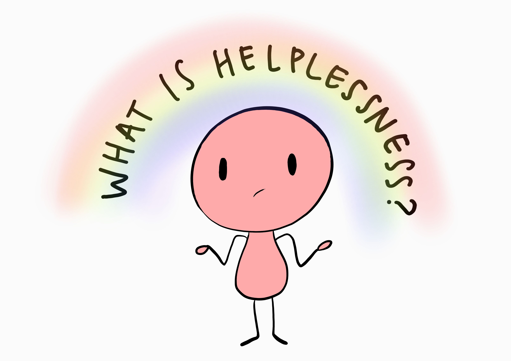
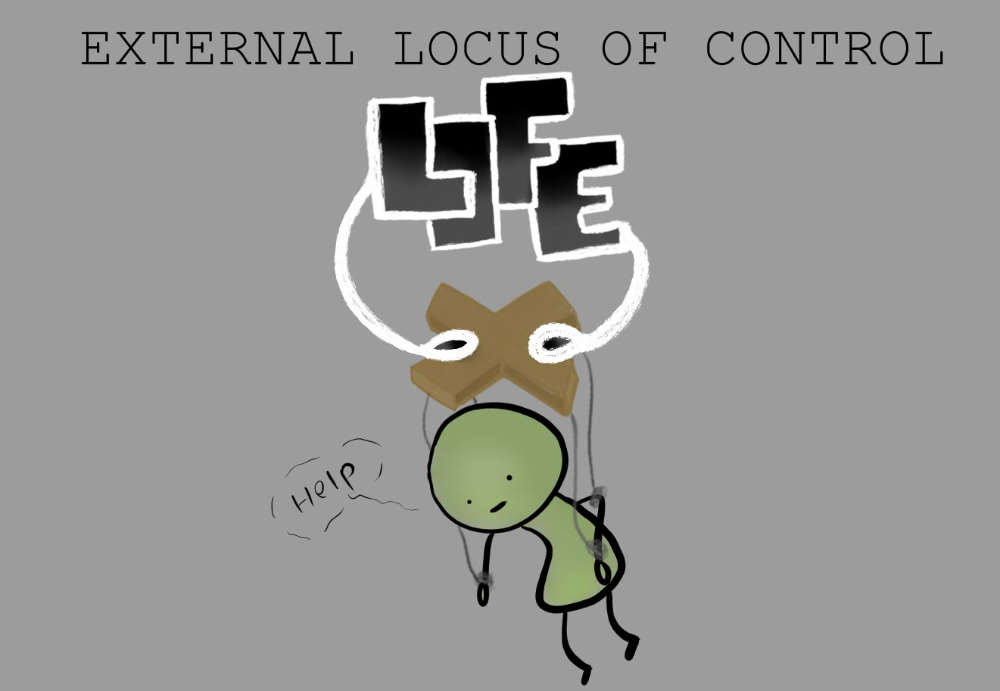
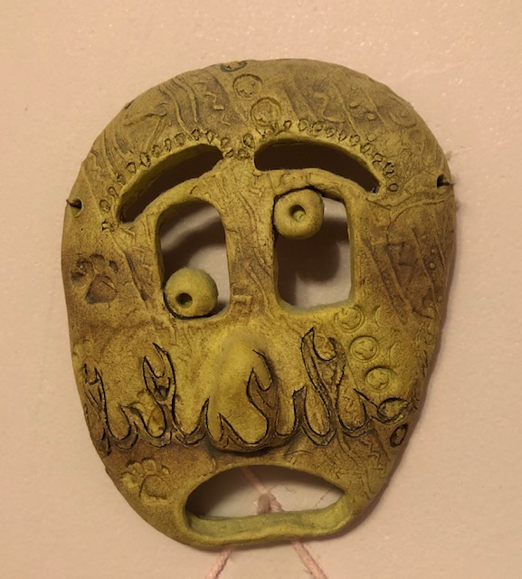

# Welcome to My Art Projects Page!

Over the years, I have become more and more invested in the creativity that is art! Art is so freeing, delicately drifting me off to a happy world of comfort when the real world isn't.  I'm sure many others feel the same way and this is one way I ended up with such amazing pieces of art in the palm of my hands at the end! Going on with the show, I will be showcasing some of my most prized art pieces! Let's GO!

## Paper Mache Boat

 

This boat was one of the first art projects I completed in 3D art and one of my proudest projects so far! The class started out with making a boat shape from cardboard and then putting paper mache on top of it in order to give the boat a more sturdy form. If you don't know what paper mache is, watch this quick [tutorial on paper mache](https://www.youtube.com/watch?v=VfmF9D4i8Tg). Next up, we decoarated our boat with some watercolors and even names our boats! I decided to go with a drip style of watercolors; dripping watercolor onto the boat and blowing the water around to create a natural, unpredicatable pattern. I also sprinkled some purple and blue paint onto the floor of my ship, which created a very spotty, yet cool design on that part of the ship. Lastly, we decorated our ships by sewing on sails and little flags on the lines of the boat and gluing a pole in the middle of the ship. 

I thought the boat I created turned out really cool (especially the main colors I picked for my boat haha) and I really enjoyed the process of making it! 

_*Side Note: We were supposed to attach a string on the top, round part of the pole to hang it, but I accidentally broke it when I was transporting it to and from school, so I  decided to attach the string on the sides of the ship XD_

## Mosaic Picture Frame 

 

Next up is the mosaic picture frame, made from gluing various sized pieces of glass onto a wooden picture frame to form an image or a pattern. This is probably the most tedious piece out of them all due to the task of having to find pieces of glass that fit with the other pieces of glass that were already placed onto the frame. Since I went with a rainbow for my frame, finding the correct pieces to transition from one color to the next also took a lot of time. After putting all the glass in place, we grouted it, filling the space in between the glass and I went with a black grout since this made all the colors pop out more. Overall, grouting took less than an hour to finish, but placing the individual pieces of glass probably took over eight to ten hours. 

In the end, the resulting picture frame looked better than any pictuer frame I have ever seen at a regular store! I was extremely happy with the piece and even happier that I was the one that made it! 

## Solar Pillow 

 

## Photography

 
 
 

## Digital Art

 
 
 

## Honorable Mentions
- Clay Mask 
 

# Header 1
## Header 2
### Header 3

- Bulleted
- List

1. Numbered
2. List

**Bold** and _Italic_ and `Code` text

[Link](url) and 

Having trouble with Pages? Check out our [documentation](https://docs.github.com/categories/github-pages-basics/) or [contact support](https://github.com/contact) and we’ll help you sort it out.
